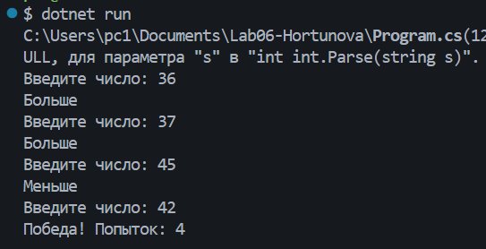
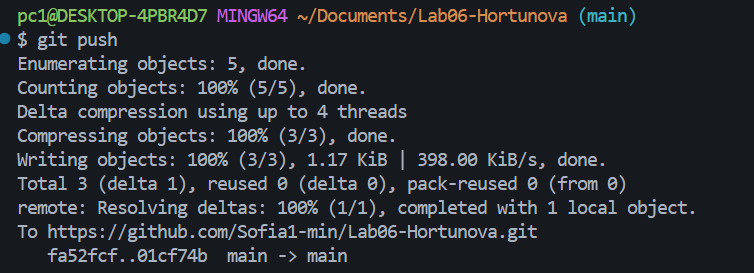

# Практическая работа №6

**ФИО:** Хортюнова София Юрьевна

**Группа:** ИСП-241

**Дата:** 08.10.2026

## Что изучено

- Цикл `for` — когда известно количество повторений.
- Цикл `while` — повторяется, пока условие истинно.
- Цикл `do while` — сначала выполняет тело, потом проверяет условие.
- `break` — остановить цикл, `continue` — пропустить итерацию.

